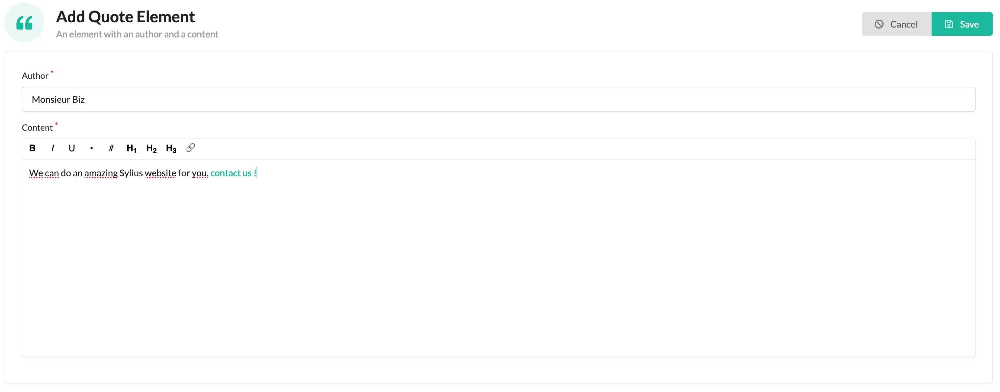
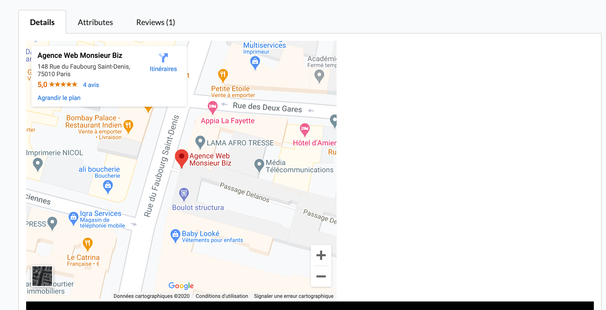

<p align="center">
    <a href="https://monsieurbiz.com" target="_blank">
        
    </a>
    &nbsp;&nbsp;&nbsp;&nbsp;
    <a href="https://sylius.com" target="_blank">
        
    </a>
</p>

<h1 align="center">Rich Editor</h1>

[](https://github.com/monsieurbiz/SyliusRichEditorPlugin/blob/master/LICENSE.txt)
[](https://travis-ci.com/monsieurbiz/SyliusRichEditorPlugin)
[](https://scrutinizer-ci.com/g/monsieurbiz/SyliusRichEditorPlugin/?branch=master)


This plugin add a rich editor on fields to be able to drag and drop elements and edit it.


## Installation

```bash
composer require monsieurbiz/sylius-rich-editor-plugin
```

Change your `config/bundles.php` file to add the line for the plugin : 

```php
<?php

return [
    //..
    MonsieurBiz\SyliusRichEditorPlugin\MonsieurBizSyliusRichEditorPlugin::class => ['all' => true],
];
```

Then create the config file in `config/packages/monsieur_biz_sylius_rich_editor.yaml` :

```yaml
imports:
  - { resource: "@MonsieurBizSyliusRichEditorPlugin/Resources/config/config.yaml" }
```

Finally import the routes in `config/routes.yaml` : 

```yaml
monsieur_biz_rich_editor_plugin:
    resource: "@MonsieurBizSyliusRichEditorPlugin/Resources/config/routing.yaml"
```

## Use the Rich Editor


### Update your form type

To make a field use the rich editor, you have to use `RichEditorType` in your field.

Here is a simple example with the description field of the `ProductTranslationType` form : 

```php
<?php

// [...]

use Sylius\Bundle\ResourceBundle\Form\Type\AbstractResourceType;
use Symfony\Component\Form\Extension\Core\Type\TextType;
use Symfony\Component\Form\FormBuilderInterface;
use MonsieurBiz\SyliusRichEditorPlugin\Form\Type\RichEditorType;

final class ProductTranslationType extends AbstractResourceType
{
    // [...]
    
    /**
     * {@inheritdoc}
     */
    public function buildForm(FormBuilderInterface $builder, array $options): void
    {
        $builder
            ->add('name', TextType::class, [
                'label' => 'sylius.form.product.name',
            ])
            ->add('slug', TextType::class, [
                'label' => 'sylius.form.product.slug',
            ])
            ->add('description', RichEditorType::class, [
                'required' => false,
                'label' => 'sylius.form.product.description',
            ])
            ->add('metaKeywords', TextType::class, [
                'required' => false,
                'label' => 'sylius.form.product.meta_keywords',
            ])
            ->add('metaDescription', TextType::class, [
                'required' => false,
                'label' => 'sylius.form.product.meta_description',
            ])
        ;
    }

    // [...]
}
```

You will have the input display as a zone in which you can drag and drop some elements : 


### Call twig render

In your template, to display the content of the rich editor as HTML, you have to call the twig filter : 

```twig
{{ content | mbiz_rich_editor_render }}
```

## Available elements

The plugin contains some simple elements

### Image element


### Quote element



### Text element


### Video element


## Create your own elements

In this example, we will add a Google Maps element.

### Create the UiElement class

```php
<?php

declare(strict_types=1);

namespace App\UiElement;

use MonsieurBiz\SyliusRichEditorPlugin\UiElement\AbstractUiElement;
use App\Form\Type\UiElement\GmapType;

class Gmap extends AbstractUiElement
{
    protected $type = 'gmap';

    // We have an image for our element, if you don't specify it, we will use a default one
    public function getImage(): string
    {
        return '/assets/shop/images/ui_elements/gmap.svg';
    }
    
    public function getFields(): array
    {
        return [
            'gmap_link',
        ];
    }

    public function getFormClass(): string
    {
        return GmapType::class;
    }
}
```

### Create the UiElement form type

```php
<?php

declare(strict_types=1);

namespace App\Form\Type\UiElement;

use Symfony\Component\Form\AbstractType;
use Symfony\Component\Form\Extension\Core\Type\TextType;
use Symfony\Component\Form\FormBuilderInterface;
use Symfony\Component\Validator\Constraints\NotBlank;

class GmapType extends AbstractType
{
    public function buildForm(FormBuilderInterface $builder, array $options)
    {
        $builder
            ->add('gmap_link', TextType::class, [
                'label' => 'monsieurbiz_richeditor_plugin.ui_element.gmap.field.gmap_link',
                'required' => true,
                'constraints' => [
                    new NotBlank(),
                ],
            ])
        ;
    }
}
```

### Declare your class as UI Element

Create or update the file `config/packages/monsieur_biz_sylius_rich_editor.yaml` and add your class : 

```yaml
monsieur_biz_sylius_rich_editor:
  ui_element_classes :
    - 'MonsieurBiz\SyliusRichEditorPlugin\UiElement\Image'
    - 'MonsieurBiz\SyliusRichEditorPlugin\UiElement\Quote'
    - 'MonsieurBiz\SyliusRichEditorPlugin\UiElement\Text'
    - 'App\UiElement\Gmap'
```

### Add translations

Don't forget to add the translations. Keys are autogenerated by the plugin or you can customize it in overriding the 
`AbstractUiElement` methods in your element.

Here is an example of possible translation for the GMap element : 

```yaml
monsieurbiz_richeditor_plugin:
    gmap:
      title: 'GMap Element'
      short_description: 'Include a GMap'
      description: 'An element with a GMap URL'
      field:
        gmap_link: 'GMap Link'
```

### Create the template to render it 

The plugin will try to find a template in `@MonsieurBizSyliusRichEditorPlugin/UiElement/gmap.html.twig`.  
You can provide a custom path in overriding the `AbstractUiElement::getTemplate` method in your element.

Here is an example of simple render for this element : 

```twig
<iframe id="gmap_canvas" src="{{ element.gmap_link }}" scrolling="no" marginheight="0" marginwidth="0" width="600" height="500" frameborder="0"></iframe>
```

### The result !




## Contributing

You can open an issue or a Pull Request if you want! 😘  
Thank you!
